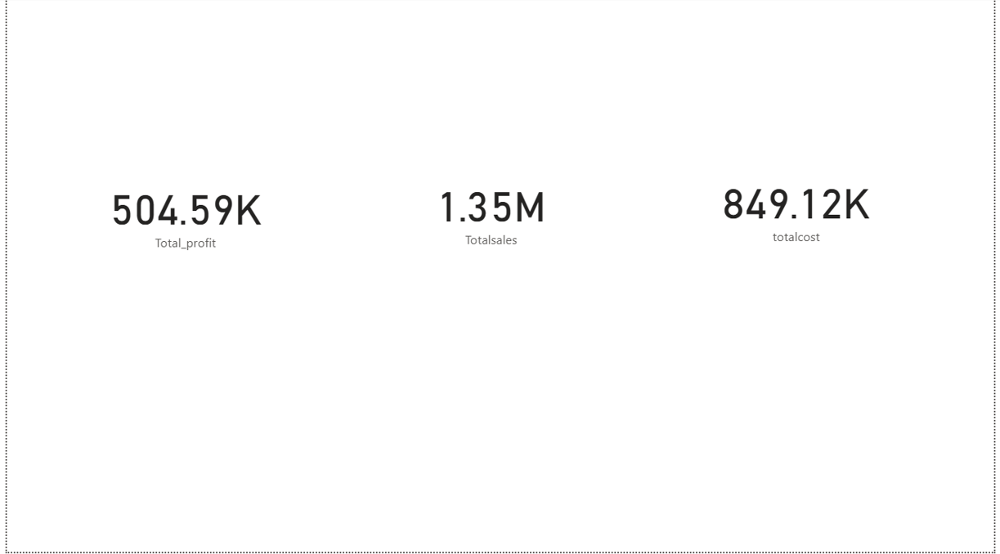
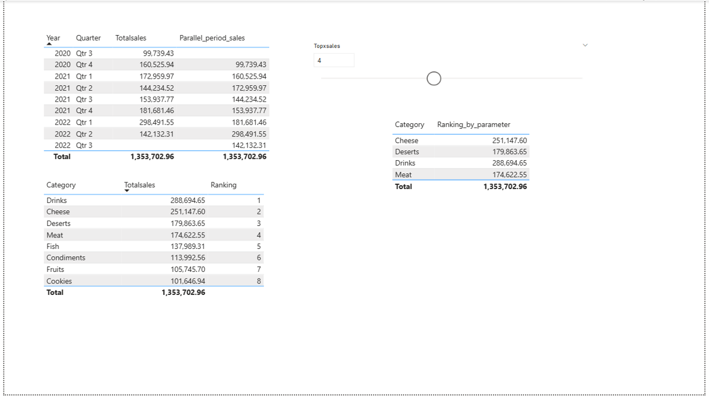
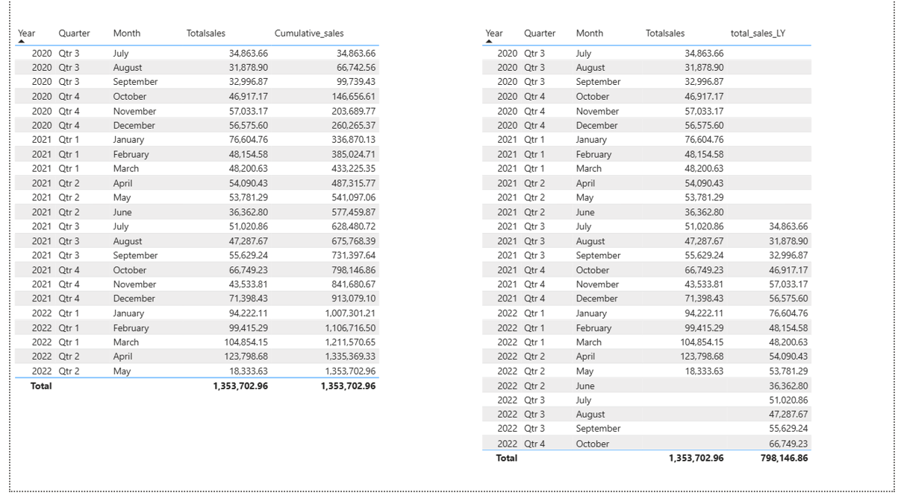
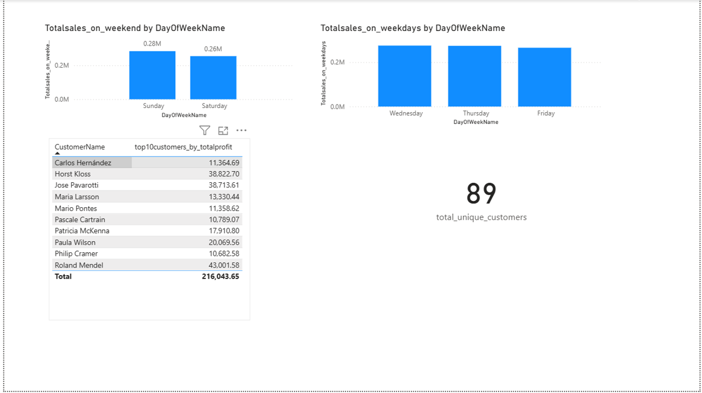
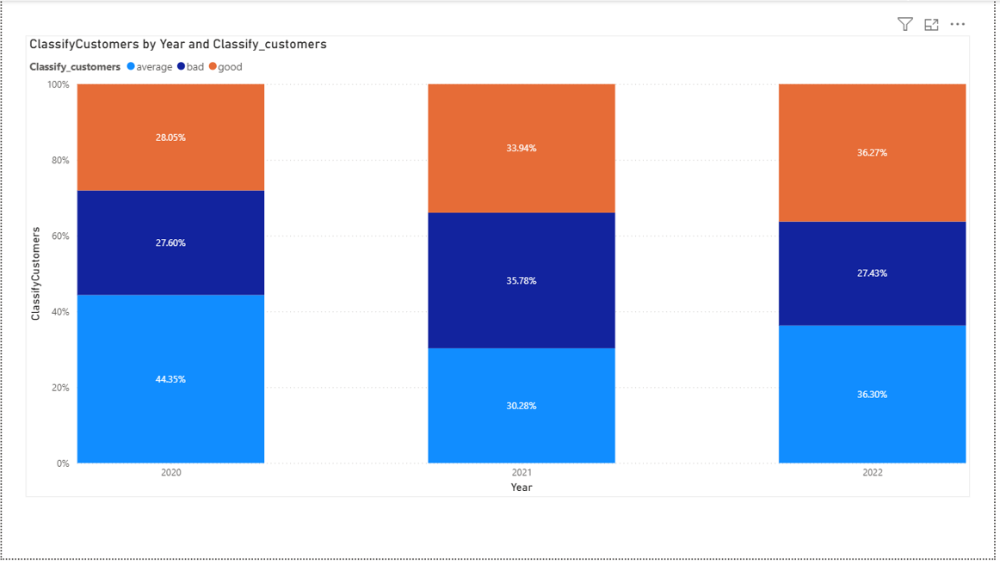
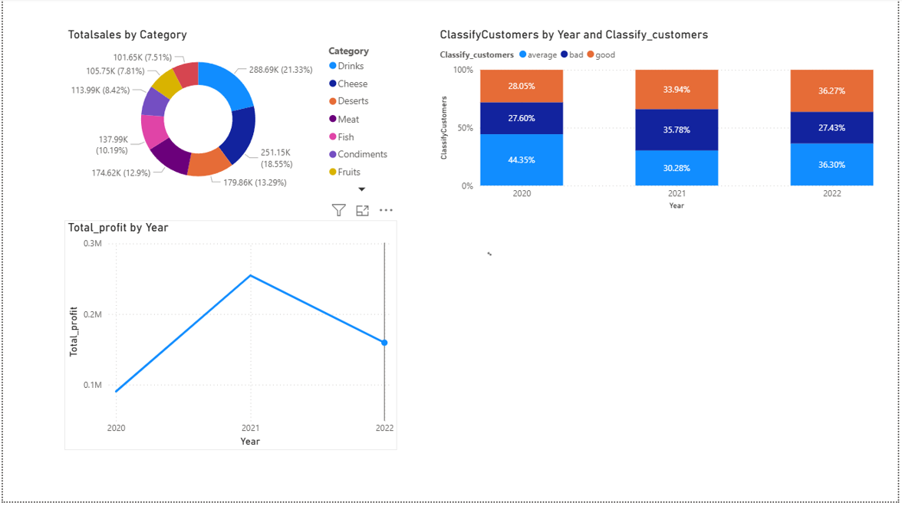

# 📊 Sales & Customer Analysis Dashboard (Power BI)

## 📌 Project Overview
This project is an **interactive Power BI dashboard** designed to analyze **sales performance, customer classification, profitability, and scenario-based forecasting**.  
It enables business users to gain actionable insights into trends, customer quality, and the impact of demand and price changes on overall sales.

The dashboard is built using **Power BI Desktop** with a clean data model, DAX measures, and intuitive visual storytelling.

---

## 🎯 Objectives
- Analyze **sales performance** across categories and years
- Classify customers into **Good, Average, and Bad** segments
- Track **profit trends** over time
- Perform **what-if analysis** using demand and price change scenarios
- Provide an **executive-level overview** of business performance

---

## 🛠 Tools & Technologies
- **Power BI Desktop**
- **DAX (Data Analysis Expressions)**
- **Data Modeling**
- **Power Query (ETL)**
- **Interactive Visualizations**

---

## 📂 Dataset Description
The project uses structured business data including:
- Orders and sales transactions
- Customer classification data
- Product categories
- Employee and supplier data
- Date and time dimensions
- Scenario parameters (Demand Change, Price Change)

---

## 📄 Dashboard Pages & Insights

### 1️⃣ Category Sales Ranking

- Sales distribution by product category
- Identifies top- and low-performing categories

### 2️⃣ Monthly Sales Performance

- Month-wise sales trend analysis
- Helps detect seasonality and performance spikes

### 3️⃣ Customer Contribution Analysis

- Contribution of different customers to total sales
- Highlights key revenue-driving customers

### 4️⃣ Scenario-Based Sales Analysis

- What-if analysis using **Demand Change** and **Price Change**
- Compares **Scenario-Based Sales vs Total Sales**
- Useful for forecasting and strategic planning

### 5️⃣ Customer Classification Analysis

- Year-wise distribution of **Good, Average, and Bad** customers
- Helps track customer quality trends over time

### 6️⃣ Business Performance Overview

- Total sales by category
- Customer classification summary
- Total profit trend by year
- High-level executive summary view

---

## 📈 Key Insights
- Enabled revenue-focused decisions by identifying product categories contributing 40% of total sales, sup
porting prioritization of high-impact categories for inventory and promotions.
- Supported strategic planning through year-over-year sales and profit analysis, revealing 76.33% profit growth
and highlighting post-2021 decline risks.
- Improved customer strategy visibility by segmenting 89 customers into value-based groups and tracking growth
in high-value customers.
---

## 🚀 How to Use
1. Download and install **Power BI Desktop**
2. Open the `.pbix` file
3. Use slicers and sliders to interact with the dashboard
4. Explore insights across different pages

---

## 📌 Future Enhancements
- Add region-wise sales analysis
- Implement forecasting using time series models
- Include KPI cards for quick performance tracking
- Deploy to Power BI Service with scheduled refresh

---

## 👤 Author
**Sarthak Sarangle**  
📍 Data Analyst | Power BI | Data Visualization  

---

## 📜 License
This project is for **educational and portfolio purposes**.  
Feel free to fork and explore.

⭐ If you like this project, consider giving it a star!
